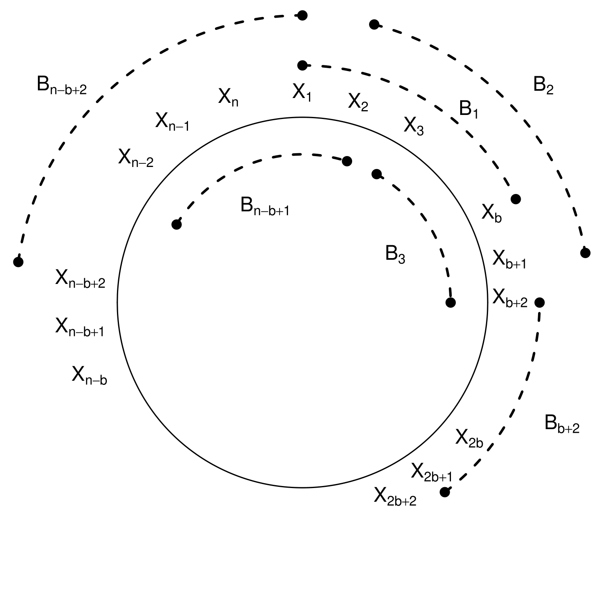

```{r, setup, include=FALSE}
knitr::opts_knit$set(root.dir = "Data")
```

\pagebreak


# Lesson 12-1: Sampling Distributions

- In time series (and statistics in general) we want to know the uncertainty in our estimates.
- First we study the sampling distributions of statistics.

## Remark 12.1.4. Improving on the Normal Approximation

- A confidence interval for the mean requires us to know the *long-run variance*,
\[
 \sigma^2_{\infty} =  \sum_{h = - \infty}^{\infty}  \gamma (h).
\]
- The $95 \%$ confidence interval based on the sample mean and the normal approximation is
\[
  \overline{X}_n \pm  1.96 \sqrt{\frac{ \widehat{\sigma_{\infty}^2} }{n} }.
\]
- There are some issues with the accuracy of this interval:

1. The accuracy of the normal approximation in finite sample (non-normality of marginal distribution).
2. Serial correlation in the time series, since
\[
   \mbox{Var} [ \sqrt{n} \overline{X}_n ] \rightarrow \sigma^2_{\infty},
\]
and the convergence can be slow.
3. Estimation of $\sigma^2_{\infty}$ by some estimator $\widehat{\sigma^2_{\infty}}$
(this could be constructed from sample autocovariances).

- So we might consider directly approximating the distribution of $\overline{X}_n$ via *resampling* from $\{ X_t \}$. This is the idea of the *bootstrap*.

## Example 12.1.6. Mean of a Gaussian AR(1).

- Suppose that $\{ X_t \}$ is a stationary Gaussian AR(1) process, with parameter $\phi_1$.
- So the spectral density is $f(\lambda) = \sigma^2 \, {| 1 - \phi_1 e^{-i \lambda} |}^{-2}$.
- The asymptotic variance of $\sqrt{n} \overline{X}$ is the long-run variance: $f(0) = \sigma^2 / {(1 - \phi_1)}^2$.
- The actual variance of $\sqrt{n} \overline{X}$ is
\[
 \gamma (0) + 2 \sum_{h=1}^{n-1} (1 - h/n) \gamma (h)
 = \frac{ \sigma^2 }{ 1 - \phi_1^2 } \,
 \left( 1 + \frac{2 \phi_1}{1 - \phi_1} \,
 \left[ (1 - \phi_1^n ) - \frac{ 1 - \phi_1^n (1 + n (1 - \phi_1) ) }{ n (1 - \phi_1) }
 \right]  \right)
\]
- For $\phi_1 > 0$, this quantity is smaller than the long-run variance.
- We illustrate for $\phi_1 = .9$ and $\sigma = 1$, so that $f(0) = 100$.

```{r}
phi <- .9
n <- seq(10,1000,10)

longrun.var <- (1-phi^2)^(-1)*(1 + 2*phi*(1-phi)^(-1)*
	((1-phi^n) - (1-phi^n*(1+n*(1-phi)))*(n*(1-phi))^(-1)))
longrun.var <- ts(longrun.var,start=10,frequency=.10)
plot(longrun.var,xlab="Sample Size",ylab="",lwd=2,col=grey(.2))
abline(h=1/(1-phi)^2,lty=3,lwd=2)
```

- Thus, using $f(0)$ instead of the true sampling variance will overestimate when $n$ is small.

# Lesson 12-2: Monte Carlo

- For this lesson, we suppose that $X_1, X_2, \ldots, X_n$ are i.i.d. with common distribution $G$.

## Fact 12.2.2. Parameters are Functionals of the Distribution

- Any parameter $\theta$ of a distribution can be expressed in terms of that distribution.
- Let $G$ be the cumulative distribution function (cdf).  Then we write $\theta$ as $\theta (G)$.

## Example 12.2.5. Median Parameter

The median $\theta$ can be written as $G^{-1} (1/2)$, where $G^{-1}$ denotes the quantile inverse.  ($G^{-1}(p) = \inf \{x: G(x) \geq p \}$.)

## Example 12.2.12. Monte Carlo Approximation to the Variance of a Statistic

- Suppose we want to know the variance of a statistic, $\eta = \mbox{Var} [ \widehat{\theta}_n ]$,
but there is no nice analytic formula.
- Monte Carlo approach: generate multiple independent copies of $\widehat{\theta}_n$, and take the sample variance of these:

1. For a large integer $M$ simulate:
\begin{align*}
  X_1^{(1)}, X_2^{(1)}, \ldots, X_n^{(1)} & \sim \, \mbox{i.i.d.} G \\
  X_1^{(2)}, X_2^{(2)}, \ldots, X_n^{(2)} & \sim \, \mbox{i.i.d.} G \\
  \vdots & \\
    X_1^{(M)}, X_2^{(M)}, \ldots, X_n^{(M)} & \sim \, \mbox{i.i.d.} G.
\end{align*}
2. For $j = 1, \ldots, M$ compute $\widehat{\theta}_n^{(j)}$ from the pseudo-data
 $X_1^{(j)}, X_2^{(j)}, \ldots, X_n^{(j)}$. 
3. Compute $\widehat{\mathbb E} [ \widehat{\theta}_n] = M^{-1} \sum_{j=1}^M \widehat{\theta}_n^{(j)}$ and
$\widehat{\eta} = M^{-1} \sum_{j=1}^M {( \widehat{\theta}_n^{(j)} - \widehat{\mathbb E} [ \widehat{\theta}_n] )}^2$, which is our estimate of $\eta$.

## Exercise 12.6. Monte Carlo Approximation to the Variance of the Median

- We use Monte Carlo to approximate the variance of the sample median.
- Consider a sample of size $n = 100$ from an AR(1) process with mean $2$, AR parameter
$\phi_1 = .8$, and Student t inputs with $4$ degrees of freedom. 
- First we load the function to simulate an ARMA with Student t inputs.

```{r}
armapq.simht <- function(n,burn,ar.coefs,ma.coefs,innovar,df,seed)
{
	p <- length(ar.coefs)
	q <- length(ma.coefs)
	set.seed(seed)
	if(df == Inf)
	{
		z <- rnorm(n+burn+p+q,sd=sqrt(innovar))
	} else 
	{
		z <- sqrt(innovar)*rt(n+burn+p+q,df=df)
	}
	x <- filter(z,c(1,ma.coefs),method="convolution",sides=1)
	x <- x[(q+1):(q+n+burn+p)]
	y <- x[1:p]
	for(t in (p+1):(p+n+burn))
	{
		next.y <- sum(ar.coefs*y[(t-1):(t-p)]) + x[t]
		y <- c(y,next.y)
	}	
	y <- y[(p+burn+1):(p+burn+n)]
	return(y)
}

n <- 100
phi1 <- .8
theta <- 2
monte <- 10000
med.mcs <- NULL
for(i in 1:monte)
{
	x.sim <- theta + armapq.simht(n,500,phi1,NULL,1,4,set.seed(i))
	med.mcs <- c(med.mcs,median(x.sim))
}
print(mean(med.mcs^2)-(mean(med.mcs))^2)
```


# Lesson 13-3: The Plug-in Principle and the Bootstrap

- We describe the plug-in method of constructing estimators, which generalizes the method-of-moments.

## Definition 12.3.1.

- If $X_1, \ldots, X_n$ are i.i.d. with common cdf $G$, then their empirical distribution function (edf) is
\[
 \widehat{G} (x)  =  \frac{1}{n} \sum_{i=1}^n  1_{ \{ X_i \leq x \} }.
\]

## Paradigm 12.3.5. The Plug-In Principle

- The edf converges uniformly to the cdf, so we can estimate $\theta$ by *plugging in*:
\[
 \widehat{\theta} = \theta ( \widehat{G}).
\]
- This is called a *plug-in estimator*.  
- It generalizes method-of-moments.

## Example 12.3.8. Plug-In Estimator of the Median

The plug-in estimator for the median is
\[
   \widehat{\theta}  = \widehat{G}^{-1} (1/2),
\]
 which is the sample median.
 
## Paradigm 12.3.9.  Classical Bootstrap for the Variance of a Statistic

- Consider a scenario where we want to know the variance of a statistic $\widehat{\theta}_n$ (computed from a sample of size $n$).
- Let $\eta = \mbox{Var} [ \widehat{\theta}_n]$.  Since $n$ is fixed and the sample is i.i.d., $\eta = \eta (G)$.
- We could estimate $\eta$ with the plug-in estimator.
- We would like to compute $\eta (\widehat{G})$, but maybe there is no formula!
- So we try to approximate it using the *bootstrap*.

1. For large $M$ simulate
\begin{align*}
  & X_1^{*(1)}, \ldots, X_n^{*(1)} \sim \mbox{i.i.d.} \widehat{G} \\
  & X_1^{*(2)}, \ldots, X_n^{*(2)} \sim \mbox{i.i.d.} \widehat{G} \\
   \vdots & \\
  & X_1^{*(M)}, \ldots, X_n^{*(M)} \sim \mbox{i.i.d.} \widehat{G}.
\end{align*}
2. For $1 \leq j \leq M$ compute $\widehat{\theta}_n^{*(j)}$ from the *pseudo-sample* $X_1^{*(j)}, \ldots, X_n^{*(j)}$.
3. Our bootstrap estimator of $\eta$ is
\[
  \frac{1}{M} \sum_{j=1}^M {\left( \widehat{\theta}_n^{*(j)}
   -  M^{-1} \sum_{k=1}^M \widehat{\theta}_n^{*(k)} \right)}^2.
\]

## Example 12.3.10.  Bootstrap for the Variance of U.S. Population Acceleration

- Consider the time series $\{ Y_t \}$ of U.S. Population. 
- One possible model is twice differencing, for which the series appears to be white noise.

```{r}
pop <- read.table("USpop.dat")
pop <- ts(pop, start = 1901)
pop.diff <- diff(diff(pop))*10^(-3)
acf(pop.diff)
```

- Suppose that $X_t = {(1-B)}^2 Y_t$ is actually i.i.d.
- The sample mean of $\{ X_t \}$ is `r mean(pop.diff)` in units of millions.
- Suppose we want to estimate the variance of this sample mean using the bootstrap (of course we could use a formula as well) with $M = 10^5$.

```{r}
n <- length(pop.diff)
pop.mean <- mean(pop.diff)
pop.edf <- sort(pop.diff)

monte.means <- NULL
Monte <- 100000
for(i in 1:Monte)
{
	monte.sample <- sample(pop.edf,size=n,replace=TRUE)
	monte.means <- c(monte.means,mean(monte.sample))
}
var.mean <- var(monte.means)
```

- The resulting estimate is `r var.mean` in units of millions.
- Note: results change each time notebook is rendered, because seed is not fixed!

# Lesson 12-4: Model-based Bootstrap

- We want to extend the bootstrap idea to the case of time series data.
- We don't want to assume i.i.d. anymore, because time series data have serial dependence.

## Paradigm 12.4.2.  Bootstrapping an AR(1) Model

- Suppose $\{ X_t \}$ is a stationary AR(1) process with i.i.d. inputs with cdf $G$:
\[
  X_t - \phi X_{t-1} = \epsilon_t,
\]
 where $\epsilon_t \sim \mbox{i.i.d.} G$.
- Suppose we want to estimate the cdf of $\widehat{\phi} - \phi$, where $\widehat{\phi}$ is the Yule-Walker estimator.
- So for any $x$, we want a bootstrap estimate of $\zeta = {\mathbb P} [ \widehat{\phi} - \phi \leq x]$.
- We compute residuals
\[
  e_t = X_t - \widehat{\phi} X_{t-1},
\]
 and use these as proxies for $\epsilon_t$.
- Center the residuals by their sample mean, and let $\widehat{G}$ be their edf.

1. For large $M$ simulate
\begin{align*}
  & \epsilon_1^{*(1)}, \ldots, \epsilon_n^{*(1)} \sim \mbox{i.i.d.} \widehat{G} \\
  & \epsilon_1^{*(2)}, \ldots, \epsilon_n^{*(2)} \sim \mbox{i.i.d.} \widehat{G} \\
  & \ldots \\
  & \epsilon_1^{*(M)}, \ldots, \epsilon_n^{*(M)} \sim \mbox{i.i.d.} \widehat{G}.
\end{align*}
2. For $1 \leq j \leq M$ construct
\[
   X_t^{*(j)} = \widehat{\phi} X_{t-1}^{*(j)} + \epsilon_t^{*(j)}
\]
for $1 \leq t \leq n$.
3. Compute $\widehat{\phi}^{*(j)}$ from the *pseudo-sample* $X_1^{*(j)}, \ldots, X_n^{*(j)}$.
4. Our bootstrap estimator of $\zeta$ is
\[
  \frac{1}{M} \sum_{j=1}^M 1_{ \{ \widehat{\phi}^{*(j)} - \widehat{\phi} \leq x  \}}.
\]


## Example 12.4.3. Bootstrap for the AR(1) Coefficient of U.S. Population Growth

- For the U.S. Population time series $\{ Y_t \}$, we can also consider fitting an AR(1) model to first differences.

```{r}
pop <- read.table("USpop.dat")
pop <- ts(pop, start = 1901)
pop.diff <- diff(pop)*10^(-6)
acf(pop.diff)
```

- Let $X_t = (1-B) Y_t$, and consider the AR(1) model for $\{ X_t\}$.
- Suppose we want to estimate the cdf of $\widehat{\phi} - \phi$ using the bootstrap with $M = 10^5$.

```{r}
n <- length(pop.diff)
kappa.hat <- pacf(pop.diff,lag=n-1,plot=FALSE)$acf[,,1]
pop.ar1 <- kappa.hat[1]
pop.resids <- pop.diff[2:n] - pop.ar1*pop.diff[1:(n-1)]
pop.resids <- pop.resids - mean(pop.resids)
pop.edf <- sort(pop.resids)

monte.roots <- NULL
Monte <- 100000
for(i in 1:Monte)
{
	monte.resids <- sample(pop.edf,size=n,replace=TRUE)
	init.value <- sample(pop.diff,size=1)
	monte.sample <- filter(monte.resids,pop.ar1,method="recursive",init=init.value)
	monte.root <- pacf(monte.sample,lag=n-1,plot=FALSE)$acf[,,1][1] - pop.ar1
	monte.roots <- c(monte.roots,monte.root)
}
# hist(monte.roots)
interval <- c(sort(monte.roots)[floor(.025*Monte)],sort(monte.roots)[floor(.975*Monte)])
```

- The AR(1) coefficient is estimated to be `r pop.ar1`.
- The $95 \%$ confidence interval based on the bootstrap is [`r pop.ar1 - interval[2]`,`r pop.ar1 - interval[1]`].
- We plot the bootstrap edf.

```{r}
plot(sort(monte.roots),seq(1,Monte)/Monte,type="l",xlab="x",ylab="",lwd=2)
```
  
## Paradigm 12.4.7. Bootstrap and the Model-Free Principle 
 
- Using a transformation (instead of a model) that produces i.i.d. residuals from the data process  is called the *model-free principle*.
- So to do a time series bootstrap, we should seek such a transformation, bootstrap the residuals, reconstruct the process, and evaluate the statistic on the pseudo-samples.
- Suppose there exists an invertible transformation $\Pi$ such that $\underline{\epsilon} = \Pi (\underline{X})$ is a vector of i.i.d. components, where $\underline{X} = {[ X_1, \ldots, X_n ]}^{\prime}$.
- Let $G$ denote the cdf of $\epsilon_t$.  
- Suppose we have a statistic $\widehat{\theta}_n$ and we want the cdf $\zeta = {\mathbb P} [ \widehat{\theta}_n - \theta \leq x]$.
- Compute the residuals, and estimate $G$ via the residual edf $\widehat{G}$.
- Then the *Model-free bootstrap* is:

1. For large $M$ simulate
\begin{align*}
  & \epsilon_1^{*(1)}, \ldots, \epsilon_n^{*(1)} \sim \mbox{i.i.d.} \widehat{G} \\
  & \epsilon_1^{*(2)}, \ldots, \epsilon_n^{*(2)} \sim \mbox{i.i.d.} \widehat{G} \\
  & \ldots \\
  & \epsilon_1^{*(M)}, \ldots, \epsilon_n^{*(M)} \sim \mbox{i.i.d.} \widehat{G}.
\end{align*}
2. For $1 \leq j \leq M$ construct
\[
   \underline{X}^{*(j)} = \Pi^{-1} [ \underline{\epsilon}^{*(j)} ].
\]
3. Compute $\widehat{\theta}_n^{*(j)}$ from the *pseudo-sample* $\underline{X}^{*(j)}$.
4. Our bootstrap estimator of $\zeta$ is
\[
  \frac{1}{M} \sum_{j=1}^M 1_{ \{ \widehat{\theta}_n^{*(j)} - \widehat{\theta} \leq x  \}}.
\]


# Lesson 12-5: Sieve Bootstraps

- We now investigate two transformations $\Pi$: the AR sieve and the MA sieve.

## Paradigm 12.5.2.  Sieves

- Consider the case that the transformation $\Pi$ involves infinitely many parameters.
- So we consider a sequence of transformations $\Pi_1, \Pi_2, \ldots$, where $\Pi_j$ has $j$ parameters.
- We suppose these transformations to be nested. This means that $\Pi_j$ is obtained from $\Pi_{j+1}$ by restricting the $j+1$th parameter to some constant value (such as zero).
- Also we suppose that taking the limit of these transformations gives $\Pi$.
- Such a collection is called a *sieve*.
- The *method of sieves* is to apply $\Pi_m$ to the sample $X_1, \ldots, X_n$, with $m$ chosen large enough that $\Pi_m \approx \Pi$, while also $m$ is small enough that we can estimate all the parameters.
- If we get additional data ($n$ increases), then we would also increase $m$.

## Paradigm 12.5.4. Autoregressive Sieve and the AR Sieve Bootstrap

- Suppose we have an AR($\infty$) process:
\[
   \Xi (B) X_t = \epsilon_t \sim \mbox{i.i.d.} G.
\]
- We take $\Pi_p$ to be an AR($p$) model.  This is called the *AR sieve*.
- Notation:
\[
   \phi^{(p)} (B) = 1 - \sum_{j=1}^p \phi_j^{(p)} B^j.
\]
- So as $p$ increases, all the coefficients can change (and we get more coefficients, too).
- The order $p$ can be linked to sample size $n$ by a formula. Or $p$ can be determined empirically, as a statistic of the sample.
- Once this $\Pi_p$ is determined, we can do an AR($p$) bootstrap (generalizing the $p=1$ case considered in previous notebook).
- Because $p$ grows with $n$, this is called the *AR sieve bootstrap*.

## Example 12.5.6. Lag 12 Autocorrelation of Gasoline Sales

- Consider the seasonally adjusted gasoline sales data.
- Apply logs and differences, obtaining a linear process (this is an assumption).

```{r}
gassa <- read.table("GasSA_2-11-13.dat")
gassa <- ts(log(gassa),start=1992,frequency=12)
gas.diff <- diff(gassa)
n <- length(gas.diff)
```

- We want to estimate $\rho (12)$, and get the cdf of $\widehat{\rho} (12) - \rho (12)$.
- We use an AR sieve bootstrap with $p=12$ (based on analysis of the PACF plot) for this sample size. There are $M=10^5$ replications, and the pseudo-samples are constructed using a burnin of $500$.

```{r}
rho.hat <- acf(gas.diff,lag=n-1,type="correlation",plot=FALSE)$acf[,,1]
gas.acf12 <- rho.hat[13]
p.order <- 12
phi.ar <- solve(toeplitz(rho.hat[1:p.order])) %*% rho.hat[2:(p.order+1)]

gas.resids <- gas.diff[(p.order+1):n]
for(i in 1:p.order) { gas.resids <- gas.resids - phi.ar[i]*gas.diff[(p.order+1-i):(n-i)] }
gas.resids <- gas.resids - mean(gas.resids)
gas.edf <- sort(gas.resids)

monte.roots <- NULL
burnin <- 500
Monte <- 100000
for(i in 1:Monte)
{
	monte.resids <- sample(gas.edf,size=n+burnin,replace=TRUE)
	init.value <- rep(0,p.order)
	monte.sample <- filter(monte.resids,phi.ar,method="recursive",init=init.value)[(burnin+1):(burnin+n)]
	monte.root <- acf(monte.sample,lag=n-1,plot=FALSE)$acf[,,1][13] - gas.acf12
	monte.roots <- c(monte.roots,monte.root)
}
# hist(monte.roots)
interval <- c(sort(monte.roots)[floor(.025*Monte)],sort(monte.roots)[floor(.975*Monte)])
```

- The lag 12 autocorrelation is estimated to be `r gas.acf12`.
- The $95 \%$ confidence interval based on the bootstrap is [`r gas.acf12 - interval[2]`,`r gas.acf12 - interval[1]`].
- We plot the bootstrap edf.

```{r}
plot(sort(monte.roots),seq(1,Monte)/Monte,type="l",xlab="x",ylab="",lwd=2)
```

## Paradigm  12.5.8. Linear Process Bootstrap

- Consider a stationary process $\{ Y_t \}$ with mean $\mu$ and acvf $\gamma (h)$.
- For a sample of size $n$, we have $\Gamma_n$ is the Toeplitz covariance matrix of the sample.  Recall that $\Gamma_n = { \{ \gamma (j-k) \}}$.
- We can taper the sample autocovariance estimators in order to estimate the whole matrix:
\[
   \breve{\gamma} (h) = \Lambda (h/d) \widehat{\gamma} (h).
\]
- Here $\Lambda$ is a *taper*, which is a symmetric function on $[-1,1]$ with non-negative values, which down-weights $\widehat{\gamma}$ when $|h|$ is large.
- Also $d$ is the *bandwidth*, which is chosen by the user, and typically satisfies $d/n \rightarrow 0$.
- For example, $\Lambda$ can be a trapezoid function.
- Then we construct $\breve{\Gamma}_n$ by inserting $\breve{\gamma} (h)$ for $\gamma (h)$, and ensuring the matrix is positive-definite.
- There is a Cholesky decomposition of the matrix, of the form
\[
   \breve{\Gamma} = L \, D \, L^{\prime},
\]
 where $L$ is unit lower-triangular and $D$ is diagonal with positive entries.
- Then we can transform the data to residuals by first subtracting the sample mean, and then multiplying the sample vector by $D^{-1/2} L^{-1}$.
- To the resulting residuals  we apply the i.i.d. bootstrap; this whole procedure is called the *Linear process bootstrap*.
- When using a trapezoidal taper, $\breve{\gamma} (h) = 0$ if $|h| > d$, so we can think of these autocovariance estimates as corresponding to an MA($d$) process.
- If we use some taper such that $\breve{\gamma} (h)$ truncates at $h = q$, the structure resembles that of an MA($q$) process, and the resulting procedure is called the *MA sieve bootstrap*.

## Example 12.5.11. Lag 1 Autocovariance of Non-Defense Capitalization

- Consider the Non-Defense Capitalization time series.
- After differencing, we wish to estimate $\gamma (1)$ and compute the cdf $\zeta = {\mathbb P} [ \widehat{\gamma} (1) - \gamma (1) \leq x]$.

```{r}
ndc <- read.table("Nondefcap.dat")
ndc <- ts(ndc[,2],start=c(1992,3),frequency=12,names= "NewOrders")
ndc.diff <- diff(ndc)
n <- length(ndc.diff)
```

- We use an MA sieve bootstrap with the truncation taper and $q=10$ for this sample size. There are $M=10^5$ replications.

```{r}
gamma.hat <- acf(ndc.diff,lag=n-1,type="covariance",plot=FALSE)$acf[,,1]
ndc.acf1 <- gamma.hat[2]
q.order <- 10
gamma.mat <- toeplitz(c(gamma.hat[1:(q.order+1)],rep(0,n-(q.order+1))))

gamma.chol <- t(chol(gamma.mat))
ndc.resids <- solve(gamma.chol,ndc.diff)
ndc.resids <- ndc.resids - mean(ndc.resids)
ndc.edf <- sort(ndc.resids)

monte.roots <- NULL
Monte <- 100000
for(i in 1:Monte)
{
	monte.resids <- sample(ndc.edf,size=n,replace=TRUE)
	monte.sample <- gamma.chol %*% monte.resids
	monte.root <- acf(monte.sample,lag=n-1,plot=FALSE,type="covariance")$acf[,,1][2] - ndc.acf1
	monte.roots <- c(monte.roots,monte.root)
}
# hist(monte.roots)
interval <- c(sort(monte.roots)[floor(.025*Monte)],sort(monte.roots)[floor(.975*Monte)])
```

- The lag 1 autocovariance is estimated to be `r ndc.acf1`.
- The $95 \%$ confidence interval based on the bootstrap is [`r ndc.acf1 - interval[2]`,`r ndc.acf1 - interval[1]`].
- We plot the bootstrap edf.

```{r}
plot(sort(monte.roots),seq(1,Monte)/Monte,type="l",xlab="x",ylab="",lwd=2)
```


# Lesson 12-6: Time Frequency Toggle Bootstrap

- We study a frequency domain sieve.

## Paradigm 12.6.1. Spectral Sieve

- The DFT $\widetilde{\underline{X}}$ is obtained from the sample $\underline{X}$ via
multiplication by $Q$: 
\[
\widetilde{\underline{X}} = Q \, \underline{X}.
\]
- The DFT has asymptotic covariance given by diagonal matrix $\Lambda$; the diagonal entries
are the spectral density evaluated at Fourier frequencies.
- So $\Lambda^{-1/2} \widetilde{\underline{X}}$ is asymptotically uncorrelated with common variance 1.
- Then 
\[
 \underline{\epsilon} = Q \, \Lambda^{-1/2} \, Q^* \, \underline{X}
\]
is an entropy-increasing transformation of the sample, and is an asymptotically uncorrelated sequence.
- We can base a bootstrap on $\underline{\epsilon}$; this is called a *spectral sieve*, because it
involves an approximation to the true spectral density, which improves as the grid of Fourier frequencies
becomes finer.
- To implement, we need an estimate of the spectral density.

## Example 12.6.3. Wolfer Sunspot Spectral Sieve

- Consider the Wolfer sunspot time series. 
- We estimate the DFT.

```{r}
wolfer <- read.table("wolfer.dat")
wolfer <- ts(wolfer,start=1749,frequency=12)
n <- length(wolfer)
gamma.hat <- acf(wolfer,lag=n-1,type="covariance",plot=FALSE)$acf[,,1]

lambda <- seq(-floor(n/2)+1,floor(n/2))*2*pi/n
Q.mat <- exp(1i*seq(-floor(n/2)+1,floor(n/2)) %x% t(lambda))/sqrt(n)
wolfer.dft <- Conj(Q.mat) %*% (wolfer-mean(wolfer))
```

- We apply a tapered spectral estimator with Bartlett taper to estimate $f$.

```{r}
d <- 3*floor(n^{1/3})
wolfer.spec <- cos(0*lambda)*gamma.hat[1]
for(h in 1:(n-1))
{
	wolfer.spec <- wolfer.spec + 2*(max(1-h/d,0))*cos(h*lambda)*gamma.hat[h+1]
}
wolfer.spec <- ts(wolfer.spec,start=0,frequency=n)
```

- Then we construct the residuals, and check that they are a white noise.
- The decorrelation is imperfect, but is sufficiently low statistically.

```{r}
wolfer.sieved <- wolfer.dft/sqrt(wolfer.spec)
wolfer.resids <- Re(Q.mat %*% wolfer.sieved)
gamma.resids <- acf(wolfer.resids,lag=n-1,type="correlation")$acf[,,1]
```

## Paradigm 12.6.8. Time Frequency Toggle Bootstrap

- We construct a bootstrap based on the spectral sieve.
- Let $\widehat{f}$ be a spectral density estimate, and $\widehat{\Lambda}$ is diagonal with entries
given by evaluating at the Fourier frequencies.
- The *frequency domain residuals* are defined as $\widehat{\Lambda}^{-1/2} \widetilde{\underline{X}}$;
these are asymptotically i.i.d. and Gaussian, by theory from Chapter 9.
- So we can generate bootstrap copies of the frequency domain residuals, transform to time domain by applying $Q$, and evaluate our statistic.
- This is called the *time frequency toggle* (TFT) bootstrap.

## Example 12.6.11. Lag 12 Autocorrelation of Gasoline Sales via TFT

- Consider the Gasoline sales time series data.
- We want to estimate the lag 12 autocorrelation, and measure the uncertainty using the TFT bootstrap.

```{r}
gassa <- read.table("GasSA_2-11-13.dat")
gassa <- ts(log(gassa),start=1992,frequency=12)
gas.diff <- diff(gassa)
n <- length(gas.diff)
gamma.hat <- acf(gas.diff,lag=n-1,type="covariance",plot=FALSE)$acf[,,1]
rho.hat <- acf(gas.diff,lag=n-1,type="correlation",plot=FALSE)$acf[,,1]
gas.acf12 <- rho.hat[13]
print(gas.acf12)
```

- We compute the DFT, and construct a spectral estimator based on a fitted AR(12).

```{r}
lambda <- seq(-floor(n/2),floor(n/2))*2*pi/n
Q.mat <- exp(1i*seq(-floor(n/2),floor(n/2)) %x% t(lambda))/sqrt(n)
gas.dft <- Conj(Q.mat) %*% (gas.diff-mean(gas.diff))

p.order <- 12
phi.ar <- solve(toeplitz(gamma.hat[1:p.order])) %*% gamma.hat[2:(p.order+1)]
sig2.ar <- gamma.hat[1] - sum(phi.ar*gamma.hat[2:(p.order+1)])
gas.spec <- rep(1,n)
for(j in 1:p.order) { gas.spec <- gas.spec - phi.ar[j]*exp(-1i*j*lambda) }
gas.spec <- sig2.ar*Mod(gas.spec)^{-2}
gas.sieved <- gas.dft/sqrt(gas.spec)
#plot(ts(Re(gas.sieved)))
#ceps.sieve <- Q.mat %*% Lambda.mat %*% Conj(Q.mat)
gas.resids <- Re(Q.mat %*% gas.sieved)
gas.tft <- gas.sieved[1:(floor(n/2)+1)]
gamma.resids <- acf(gas.resids,lag=n-1,type="correlation")$acf[,,1]
```

- Next, we do the bootstrapping on the frequency domain residuals.

```{r}
gas.tft <- gas.tft - mean(gas.tft)
gas.edf.re <- sort(Re(gas.tft))
gas.edf.im <- sort(Im(gas.tft))

monte.roots <- NULL
Monte <- 100000
for(i in 1:Monte)
{
	monte.resids <- sample(gas.edf.re,size=(floor(n/2)+1),replace=TRUE) + 
				1i*sample(gas.edf.im,size=(floor(n/2)+1),replace=TRUE)
	monte.resids[(floor(n/2)+1)] <- Re(monte.resids[(floor(n/2)+1)])
	monte.resids <- c(monte.resids,Conj(rev(monte.resids)[-1]))
	monte.sample <- Q.mat %*% monte.resids*sqrt(gas.spec)
	monte.sample <- Re(monte.sample)
	monte.root <- acf(monte.sample,lag=n-1,plot=FALSE,type="correlation")$acf[,,1][13] - gas.acf12
	monte.roots <- c(monte.roots,monte.root)
}
print(c(sort(monte.roots)[floor(.025*Monte)],sort(monte.roots)[floor(.975*Monte)]))
plot(sort(monte.roots),seq(1,Monte)/Monte,type="l",xlab="x",ylab="",lwd=2,col=grey(.2))
```


# Lesson 12-7: Subsampling

- An alternative to the bootstrap is to replicate properties of the sample by examining *subsamples*.

## Paradigm 12.7.1. Roots and Subsampling

- Suppose that $\{ X_t \}$ is strictly stationary.
- We also suppose that the process is $m$-dependent, which says that serial dependence vanishes between variables that are more than lag $m$ apart.   
- Suppose $\widehat{\theta}_n$ is an estimator of $\theta$ based on the sample $X_1, \ldots, X_n$.
- Suppose that $\tau_n$ is a rate of convergence for the estimator, such that
\[
   \tau_n (\widehat{\theta}_n - \theta) \Rightarrow S,
\]
 where $S$ is some random variable with cdf $J$.  
- The cdf of our centered statistic is
\[
 J_n (x) = {\mathbb P} [  \tau_n (\widehat{\theta}_n - \theta) \leq x ].
\]
- So $J_n (x) \rightarrow J(x)$ as $n \rightarrow \infty$.
- We can compute the statistic on smaller sub-spans of the full sample, and the corresponding cdf will also converge.

## Paradigm 12.7.2. Blocking Schemes

- We can divide $X_1, \ldots, X_n$ into smaller blocks.
- Here we focus on overlapping blocks of size $b$, where $b < n$.
- There are $Q = n-b+1$ such blocks, or *subsamples*. For $1 \leq i \leq Q$
\[
  X_{i}, \ldots, X_{i+b-1}
\]
is the $i$th subsample.
- Adjacent blocks have $b-1$ values in common.

## Paradigm 12.7.5. Subsampling Methodology

- Consider overlapping blocks, and evaluate the statistic on each:
\[
 \widehat{\theta}_{b,i} = \widehat{\theta} ( X_{i}, \ldots, X_{i+b-1}).
\]
- The centered statistic is then
\[
  Z_{b,i} = \tau_b  (\widehat{\theta}_{b,i} - \theta ).
\]
Note the rate is $\tau_b$, not $\tau_n$.
- As $b \rightarrow \infty$, the cdf of $Z_{b,i}$ tends to $J$, for each $i$.
- Fixing $b$, each $Z_{b,i}$ has the same distribution, and they are dependent random variables. The idea is to take their edf to estimate $J_n (x)$.
- However, $\theta$ in $Z_{b,i}$ is unknown, so we replace it by $\widehat{\theta}_n$ based on the whole sample, which converges at a faster rate.
\[
    \widehat{Z}_{b,i} = \tau_b  (\widehat{\theta}_{b,i} - \widehat{\theta} ).
\]
- The *classical subsampling estimator* is then defined as
\[
   L_{n,b} (x) = \frac{1}{Q} \sum_{i=1}^Q 1_{ \{ \widehat{Z}_{b,i} \leq x \} }.
\]
- This is an edf.  Its quantiles are the order statistics of $\widehat{Z}_{b,i}$.
- Neighboring blocks share lots of time series observations, and the corresponding $\widehat{Z}_{b,i}$ random variables will be more highly correlated.
- By the $m$-dependence assumption, blocks that are sufficiently separated (far apart from one another) will be uncorrelated. 
- Assuming that $\tau_b/ \tau_n \rightarrow 0$, the result is a consistent estimator of $J(x)$, and the difference $L_{n,b} (x) - J_n (x)$ tends to zero in probability.

## Example 12.7.13. Subsampling Inference for Lag 1 Autocovariance of Non-Defense Capitalization

- Consider the Non-Defense Capitalization time series.
- After differencing, we wish to estimate $\gamma (1)$ and compute the cdf $\zeta = {\mathbb P} [ \widehat{\gamma} (1) - \gamma (1) \leq x]$.

```{r}
ndc <- read.table("Nondefcap.dat")
ndc <- ts(ndc[,2],start=c(1992,3),frequency=12,names= "NewOrders")
ndc.diff <- diff(ndc)
n <- length(ndc.diff)
gamma.hat <- acf(ndc.diff,lag=n-1,type="covariance",plot=FALSE)$acf[,,1]
ndc.acf1 <- gamma.hat[2]
```

- The lag 1 autocovariance is estimated to be `r ndc.acf1`.
- We use the subsampling methodology, with $\tau_n = \sqrt{n}$. 
- First consider $b = 5$.

```{r}
b.sub <- 5
q.sub <- floor(n-b.sub+1)
sub.edf <- NULL
for(i in 1:q.sub)
{
	sub.ndc <- ndc.diff[i:(i+b.sub-1)]
	gamma.sub <- acf(sub.ndc,lag=b.sub-1,type="covariance",plot=FALSE)$acf[,,1]
	sub.edf <- c(sub.edf,sqrt(b.sub)*(gamma.sub[2]-ndc.acf1))
}
sub.edf <- sort(sub.edf)
interval <- c(sub.edf[floor(.025*q.sub)],sub.edf[floor(.975*q.sub)])
```

- The $95 \%$ confidence interval based on subsampling is [`r ndc.acf1 - interval[2]`,`r ndc.acf1 - interval[1]`].
- We plot the subsampling edf.

```{r}
plot(sub.edf,seq(1,q.sub)/q.sub,type="l",xlab="x",ylab="",lwd=2)
```

- Repeat with $b = 10$.

```{r}
b.sub <- 10
q.sub <- floor(n-b.sub+1)
sub.edf <- NULL
for(i in 1:q.sub)
{
	sub.ndc <- ndc.diff[i:(i+b.sub-1)]
	gamma.sub <- acf(sub.ndc,lag=b.sub-1,type="covariance",plot=FALSE)$acf[,,1]
	sub.edf <- c(sub.edf,sqrt(b.sub)*(gamma.sub[2]-ndc.acf1))
}
sub.edf <- sort(sub.edf)
interval <- c(sub.edf[floor(.025*q.sub)],sub.edf[floor(.975*q.sub)])
```

- The $95 \%$ confidence interval based on subsampling is [`r ndc.acf1 - interval[2]`,`r ndc.acf1 - interval[1]`].
- We plot the subsampling edf.

```{r}
plot(sub.edf,seq(1,q.sub)/q.sub,type="l",xlab="x",ylab="",lwd=2)
```

# Lesson 12-8: Block Bootstrap

- We now look at *block bootstrap methods*, which is similar in spirit to subsampling.
- We take sub-spans of the time series, and then patch them together to generate a synthetic time series that functions as our pseudo-sample.

## Paradigm 12.8.2. Block Bootstrap for the Sample Mean

- Suppose we have a stationary time series $\{ X_t \}$.
- Suppose $\theta$ is the mean, and $\widehat{\theta}$ is the sample mean. Then
\[
  J_n (x) = {\mathbb P} [ \sqrt{n} (\widehat{\theta} - \theta) \leq x] \rightarrow J(x),
\]
 where $J(x) = \Phi (x/\sigma_{\infty})$.
- Let $b$ be small relative to $n$, as in the subsampling method.
- Divide the sample into $Q = n-b+1$ overlapping blocks.
- We want to construct a length $n$ pseudo-sample from length $b$ blocks, so we require $k = n/b$ such blocks.
- Idea: randomly draw from the $Q$ blocks, and then paste them together!
- Denote those $Q$ blocks of random variables as $B_1, \ldots, B_Q$.

1. For $1 \leq j \leq M$, draw $B_1^{*(j)}, \ldots, B_k^{*(j)}$ randomly (with replacement) from the set of available blocks $B_1, \ldots, B_Q$.
2. Concatenate for each $j$ those draws, obtaining the $j$th pseudo-series $X_1^{*(j)}, \ldots, X_n^{*(j)}$.
3. Compute the statistic on each pseudo-series, denoted $\widehat{\theta}_n^{*(j)}$.
4. We estimate $J_n (x)$ with
\[
  \frac{1}{M} \sum_{j=1}^M 1_{ \{ \sqrt{n} (\widehat{\theta}_n^{*(j)} - \widehat{\theta}_n ) \leq x \} }.
\]

- Just like subsampling, we insert $\widehat{\theta}_n$ for $\theta$.
- There is a variant called the *tapered block bootstrap*, where observations at the edge of a block $B_k$ get down-weighted.

## Exercise 12.33.  Block Bootstrap for the Mauna Loa Mean

- Consider annual differences of the logged Mauna Loa CO2 time series.
- We want to estimate the mean using block bootstrap. So we apply the above method to obtain the cdf of the centered statistic.

```{r}
mau <- read.table("mauna.dat",header=TRUE,sep="")
mau <- ts(mau,start=1958,frequency=12)
mau.gr <- 1000*diff(log(mau),lag=12)
n <- length(mau.gr)
mau.mean <- mean(mau.gr)
```

- The sample mean (after rescaling) is `r mau.mean`.
- First try $b = \sqrt{n}$ and $M = 10^5$.
- We can also try $b = n^{1/3}$ and $b = n^{2/3}$ by rerunning the code chunk.

```{r}
# Make choice of b, and then run 
b <- ceiling(sqrt(n))
#b <- ceiling(n^(1/3))
#b <- ceiling(n^(2/3))

k <- ceiling(n/b)
Q.big <- n - b + 1
monte.roots <- NULL
Monte <- 100000
for(i in 1:Monte)
{
	monte.sample <- NULL
	for(j in 1:k)
	{
		boot.index <- sample(Q.big,size=1)
		monte.sample <- c(monte.sample,mau.gr[seq(boot.index,boot.index+b-1)])
	}
	monte.sample <- monte.sample[1:n]
      monte.root <- mean(monte.sample) - mau.mean
	monte.roots <- c(monte.roots,monte.root)
}
interval <- c(sort(monte.roots)[floor(.025*Monte)],sort(monte.roots)[floor(.975*Monte)])
```

- The $95 \%$ confidence interval based on the bootstrap is [`r mau.mean - interval[2]`,`r mau.mean - interval[1]`].
- We plot the bootstrap edf.

```{r}
plot(sort(monte.roots),seq(1,Monte)/Monte,type="l",xlab="x",ylab="",lwd=2)
```




 

